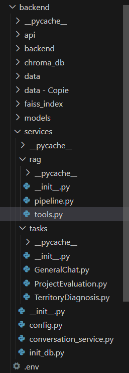

Architecture du Backend
=======================

L’architecture suit une séparation claire des responsabilités :

- **API Layer** (`api/`) : définit les routes FastAPI pour accéder aux fonctionnalités.
- **Services Layer** (`services/`) : logique métier et intelligence métier.
  - `tasks/` : contient des services dédiés aux types de tâches : chat général, évaluation de projets, diagnostic territorial.
  - `rag/` : contient le cœur du pipeline RAG (`pipeline.py`), les outils de traitement (`tools.py`), etc.
- **Data Layer** :
  - `chroma_db/` et `faiss_index/` : pour le stockage vectoriel.
  - `init_db.py`, `conversation_service.py`, `config.py` : gestion des connexions à la base de données PostgreSQL et configuration.
